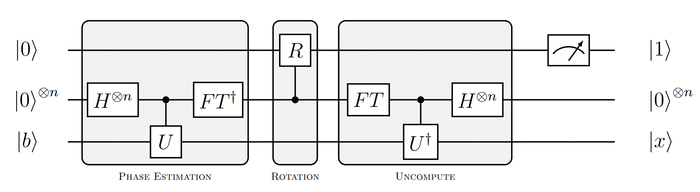
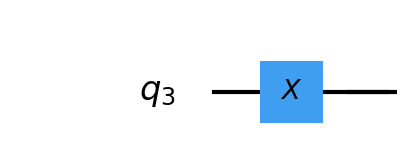
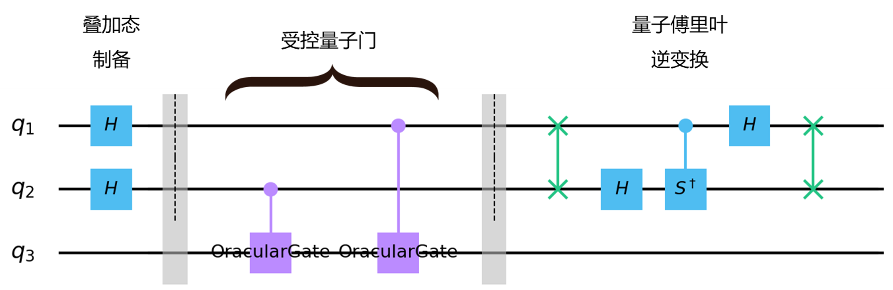
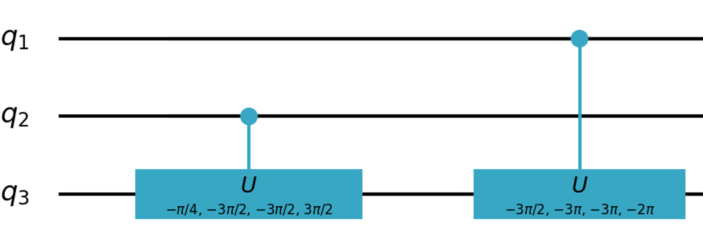
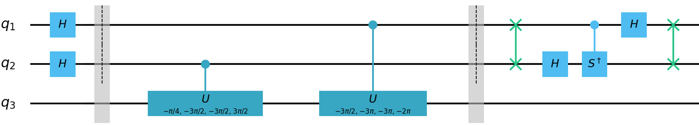
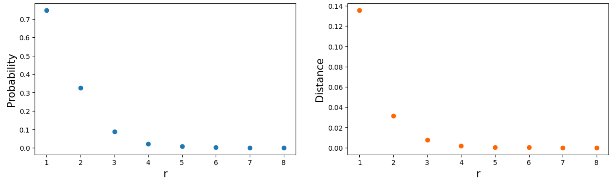
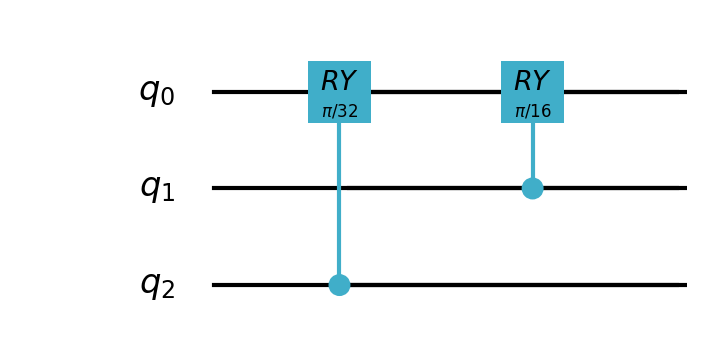
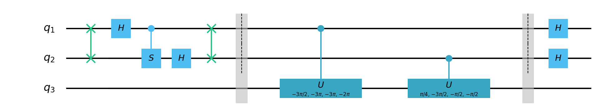
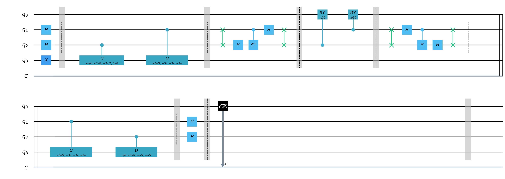

# HHL

## 1. 题目简述

基于HHL（Harrow-Hassidim-Lloyd）算法求解线性方程组$Ax=b$，其中 $A$ 与 $b$ 分别为：

$$
\begin{equation}
A = \begin{pmatrix}
 1 & 1 \\
 \frac{\sqrt{2}}{2} & -\frac{\sqrt{2}}{2}
\end{pmatrix}, b = \begin{pmatrix}
 \frac{1}{2} \\
 -\frac{\sqrt{2}}{2}
\end{pmatrix}
\end{equation}
$$

线路宽度限制为4量子比特，求解上述方程并返回解 $x$ 与HHL算法量子线路OriginIR信息。

## 2. 算法原理简述

HHL算法的基本思路可以理解为，首先可以将矩阵 $A$ 基于谱分解表示为 $A = \sum_{j=0}^{N-1}\lambda_j|\mu_j\rangle \langle\mu_j|$ 的形式，从而其逆矩阵有 $A^{-1} = \sum_{j=0}^{N-1}\lambda_j^{-1}|\mu_j\rangle \langle\mu_j|$。接着对于 $b$，在 $A$ 的特征空间上分解可表示为 $|b\rangle = \sum_{j=0}^{N-1}\beta_j|\mu_j\rangle$，则解 $x = A^{-1}b$可表示为：$|x\rangle = A^{-1}|b\rangle = \sum_{j=0}^{N-1}\lambda_j^{-1}\beta_j|\mu_j\rangle$。从而目标是利用量子线路推演出 $\sum_{j=0}^{N-1}\lambda_j^{-1}\beta_j|\mu_j\rangle$。详细的步骤参考：[Quantum algorithm for linear systems of equations](https://arxiv.org/abs/0811.3171)。

HHL算法的基本量子线路结构如下图1所示。其中量子寄存器从上到下可以标记为：辅助寄存器、用于相位估计的时钟寄存器以及编码 $b$ 的输入寄存器。该算法可分为三个主要步骤：（1）相位估计（Phase Estimation）。从而将存储在概率幅上的特征值信息提取到基态上。（2）受控旋转（Controlled Rotation）。使用受控旋转操作巧妙的将提取到基态的特征值信息以倒数的形式（以一定比例）恢复到对应态的概率幅上。（3）逆相位估计（去操作（Uncompute））。恢复时钟寄存器的状态。

<center>
    
    <p>图 1. HHL 算法</p>
</center>

最后，通过测量辅助寄存器，当其输出为1时候对应有输入寄存器的状态将坍缩至 $\sum_{j=0}^{N-1}C\frac{\beta_j}{\lambda_j}|\mu_j\rangle$，其中 $C$ 为归一化系数，从而此时输入寄存器的状态为归一化的解 $\frac{A^{-1}b}{\left \| A^{-1}b \right \| }$的近似态 $|\bar{x}\rangle$。

## 3. 算法实现

本节介绍基于pyqpanda实现HHL算法求解线性方程组$Ax=b$的实现步骤。共使用4个量子比特，其中 $qubits[0]$对应辅助寄存器；$qubits[1]$与$qubits[2]$对应用于相位估计的时钟寄存器；$qubits[3]$ 对应输入寄存器。

### 3.1 预处理

对于HHL算法而言，其输入为线性方程组$Ax=b$中的$A$与$b$。首先，从HHL算法原理来看，为使得可以谱分解表示矩阵 $A$，需要求矩阵 $A$ 为 Hermitian（即满足共轭对称，$A = A^{\dagger}$）。此外，考虑选择振幅编码（amplitude encode）来将 $b$ 编码至输入寄存器，则要求向量 $b$ 归一化。为此，在运行HHL算法前，有必要就输入进行适当的预处理以满足输入上述要求。

（1）Hermitian条件满足。首先，使用如下的工具函数判断输入的 $A$ 是否为 Hermitian：

```python
    Dag = lambda matrix: matrix.conj().T
    
    def is_hermitian(matrix):
        return np.allclose(matrix, Dag(matrix))
```

即简单的比较 $A$ 是否等于 $A^{\dagger}$。对于该题目而言，显然不满足。为此需要对 $A$ 进行必要的转换以使之满足HHL算法的适用条件。一种可行的办法是基于 $A$ 构造如下的新矩阵以满足Hermitian要求：

$$
\begin{equation}
    C = \begin{pmatrix}
 0 & A \\
 A^{\dagger} & 0
\end{pmatrix}
\end{equation}
$$

但这样做加大了算法需要处理的矩阵维度。本实现中考虑如下的预处理以解决该问题：

$$
\begin{equation}
    (A^{\dagger}A)x = A^{\dagger}b
\end{equation}
$$

从而 $A' = A^{\dagger}A$ 满足Hermitian条件。同时对应的另一个输入 $b$ 也转换为 $b'=A^{\dagger}b$。

（2）归一化条件。即要求向量 $b$ 归一化。可以通过简单的除模计算得到归一化后的向量：

```python
    normed_b = (b / np.linalg.norm(b)).round(4)
```

对于该问题而言，经过Hermitian条件满足的预处理后的 $A^{\dagger}b=(0, 1)^{T}$已经自身归一化。

### 3.2 输入态制备

选用振幅编码将已归一化的 $b'$ 编码至输入寄存器，可以使用pyqpanda提供的 $amplitude\_encode$ 函数完成上述量子态编码。对于本问题，归一化后的向量 $b' = (0, 1)^T$，则可以简单的使用一个 $X$ 门完成对应的编码操作：

```python
    def encode(b):
    circuit = create_empty_circuit()
#     circuit << amplitude_encode(qubits[3], b)
    circuit << X(qubits[3])
    
    return circuit
```

对应编码结果如下图2所示：


<center>
    
    <p>图 2. 状态制备</p>
</center>

### 3.3 相位估计

此部分完成HHL算法主要步骤中的第一个：量子相位估计。针对$2\times2$矩阵的量子相位估计线路实现如图3所示（see [Quantum circuit design for solving linear systems of equations](https://arxiv.org/abs/1110.2232)）。其包含量子叠加态制备、受控量子门操作以提取特征值相位$\varphi$以及一个量子傅里叶逆变换（IQFT）将所提取的相位信息提取至基态上。

其中的受控量子门部分需要实现一组受控酉门 $C-U^{2^j}, j=0, 1, ...$。其中酉算子 $U$ 为基于HHL算法输入 $A$ 的哈密顿量模拟（Hamilton Simulation）结果：$e^{iAt}$。设酉算子 $U$ 具有一个特征值 $e^{2\pi i\varphi}$，则相位估计的结果即以一定的精度（与时钟寄存器量子比特数有关）估计其中的 $\varphi$。


<center>
    
    <p>图 3. 量子相位估计</p>
</center>

考虑本问题，对上述预处理后的 $A'$，取$t=\frac{\pi}{2}$时的哈密顿量模拟结果 $U$ 具有特征值 $-1$ 与 $i$。对应的相位估计结果分别为 0.5与0.25。在2量子比特时钟寄存器下可以准确的表达目标$\varphi$。则使用 pyqpanda 自带的 $expMat$ 完成哈密顿量模拟，并使用 $QOracle$ 实现自定义受控酉门如下：

```python
# C-U^1
QOracle(qubits[3], expMat(1j, A, np.pi / 2)).control(qubits[2])
# C-U^2
QOracle(qubits[3], expMat(1j, A, np.pi)).control(qubits[1])
```

然而上述实现使用的 $QOracle$ 无法经 $convert\_qprog\_to\_originir$ 转为 OriginIR输出。因此，参考论[Step-by-step hhl algorithm walkthrough to enhance the understanding of critical quantum computing concepts](https://arxiv.org/abs/2108.09004)中的思路，使用 4 参数的 $CU$ 门来实现等效的受控酉门 $C-U^{2^j}$，如下图4所示：

<center>
    
    <p>图 4. 基于 CU 门实现受控酉门</p>
</center>


此外，该量子相位估计中所使用的双量子比特量子傅里叶逆变换（IQFT）线路如下图5所示。

<center>
    
    <p>图 5. 双量子比特IQFT</p>
</center>


则完整的相位估计线路如下图6所示。

<center>
    
    <p>图 6. 相位估计实现</p>
</center>


### 3.4 受控旋转

受控旋转操作实现了将提取到基态的特征值信息以倒数的形式还原到概率幅上的功能。其中使用的旋转门作用于辅助寄存器 $qubits[0]$，具有如下的使用效果：

$$
\begin{equation}
    R_y(\theta_j)|0\rangle = \sqrt{1-(\frac{C}{\lambda_j})^2}|0\rangle + \frac{C}{\lambda_j}|1\rangle
\end{equation}
$$

其中 $C$ 是归一化系数且满足$C \leq min_j|\lambda_j|$，旋转角度 $\theta$ 满足 $\theta_j = 2arcsin(C/\lambda_j)$，则在 $C/\lambda_j$ 较小的情况下，有角度估计值 $\tilde{\theta_j} = 2C/\lambda_j$。

对本问题而言，$A'$ 具有特征值$\lambda_1=2$与$\lambda_2=1$，参考论文\cite{PE}的做法，取$C=\pi/2^r$。从而在$r$较大的情况下，系数 $C$ 较小使得 则$\tilde{\theta_1}=\pi/2^r$，$\tilde{\theta_2}=\pi/2^{(r-1)}$。$r$ 的选择与HHL算法的成功率以及所求解的估计值的精确度等相关。针对不同 $r$ 的取值，测量辅助比特得到1的概率以及所求得解$\bar{x}$（经后处理还原） 与真实解$x$ 的距离（此处取欧式距离）如下图7所示（具体求解方法见后文，此处主要解释r的选择）。

<center>
    
    <p>图 7. r与测量概率和解近似度关系</p>
</center>

则本实验中选择 $r=5$以尽可能保证测量成功率的同时获取较好的算法输出准确率，有受控旋转部分实现如图8所示。

<center>
    
    <p>图 8. 受控旋转</p>
</center>

### 3.5 去操作

此部分为与相位估计部分相对称的去操作。以还原时钟寄存器状态。则对应线路如下图9所示：

<center>
    
    <p>图 9. 去操作</p>
</center>


至此，完整的HHL算法线路为：

```python
    # Step 1. state preparation
    prog << encode(normed_b)
    
    # Step 2. phase estimation
    prog << phase_estimation(A)
    
    # Step 3. rotation
    prog << rotation()
    
    # Step 4. uncompute
    prog << uncompute(A)
```

其中具体的辅助函数实现见代码。

### 3.6 测量

HHL算法测量部分，当辅助比特（对应qubits[0]）测量结果为1时候对应输入寄存器结果为目标解。则此部分相关代码实现为：

```python
    prog << Measure(qubits[0], cbits[0])
    
    result = directly_run(prog)
    if not result['c0']:
        return HHL(A, b)
```

注意测量结果中 $result['c0'] = True$ 对应测量结果为1，且当测量结果不为1时候递归的重新调用HHL算法进行求解。

当测量结果为1时候，此时读取寄存器状态（使用 $get\_qstate()$ ）。则输入寄存器为 $|0\rangle$ 的概率振幅对应 $get\_qstate()[1]$（即对应系统状态 $|0001\rangle$）;输入寄存器为 $|1\rangle$ 的概率振幅对应 $get\_qstate()[9]$（即对应系统状态 $|1001\rangle$）。取其中的实数部分（忽视极其小的虚数部分）得到归一化的解 $\frac{A^{-1}b}{\left \| A^{-1}b \right \| }$的近似态 $|\bar{x}\rangle$（即代码中的$normed\_x$）。

```python
    # Step 6. get results
    qstate = get_qstate()
    # 0001 1001
    normed_x = np.real(np.array([qstate[1], qstate[9]]))
```

### 3.7 完整线路

则完整的线路包含状态制备、相位估计、受控旋转、去处理以及测量部分如图10所示：

<center>
    
    <p>图 10. 完整线路</p>
</center>

### 3.8 后处理

如前所述，此时输入寄存器中的状态为归一化的解的近似态，为获取目标的解$x$，需要基于上述求得的$normed\_x$作进一步的后处理以恢复真正的解。

首先，假设求得的$normed\_x$（记为 $\bar{x}$）如下（考虑本题的数据维度）：

$$
\begin{equation}
    \bar{x} = \begin{pmatrix}
x_1 \\ x_2

\end{pmatrix}
\end{equation}
$$

注意到真实解 $x$ 与归一化解具有线性关系：

$$
\begin{equation}
    x = \begin{pmatrix}
k \cdot x_1 \\ k \cdot x_2

\end{pmatrix}
\end{equation}
$$

则恢复真实解 $x$ 的关键在于求出其中的缩放比例 $k$。则 $Ax=b$ 有：


$$
\begin{equation}
    \begin{pmatrix}
  a_{11} & a_{12} \\
  a_{21} & a_{22}
\end{pmatrix} \begin{pmatrix}
 k \cdot x_1 \\ k \cdot x_2
\end{pmatrix} = \begin{pmatrix}
 b_1 \\ b_2
\end{pmatrix}
\end{equation}
$$

从而可列出方程组：

$$
\begin{equation}
    \left\{\begin{matrix}
  a_{11}kx_1 + a_{12}kx_2 &= b_1 \\
  a_{21}kx_1 + a_{22}kx_2 &= b_2
\end{matrix}\right.
\end{equation}
$$

其中求任意一个方程均可求出目标的缩放比例 $k$，对应的代码实现如下。其中忽略了 $b_i$ 的值为0（或极小）的情况，因为此时计算出的 $k$ 接近0（不符合 $k$ 的含义）。

```python
    # Step 7. recover x
    N = len(normed_b)
    ratio = 0.0
    for i in range(N):
        if not abs(normed_b[i]) < 1e-8:
            ratio = normed_b[i][0] / \
                np.sum([normed_x[j] * A[i][j] for j in range(N)])
            break
```

### 3.9 结果

首先，使用经典求解线性方程组的方法可以简单的计算出带求解线性方程组 $Ax=b$ 的解 $x = (-0.25, 0.75)^T$。

经由上述HHL算法求解，当测量辅助比特结果为1时候，得到输入寄存器对应的状态（即归一化解$\bar{x}$）为 $(-0.3157702, 0.9488357)^T$。基于前述恢复解过程求得缩放比例为$ratio=0.7902836521431533$。从而求得的解为$ratio \cdot \bar{x} = (-0.24954802, 0.74984934)^T$。

计算所求解与真实解间的欧式距离为0.0004764，可见基于上述HHL算法实现可以很好的计算出该线性方程组的解。

### 3.10 OriginIR输出

按题目要求同时输出了对应HHL算法的OriginIR指令序列如下所示：

```
QINIT 4
CREG 4
X q[3]
H q[1]
H q[2]
BARRIER q[1],q[2]
CU q[2],q[3],(-0.78539816,-4.712389,-4.712389,4.712389)
CU q[1],q[3],(-4.712389,-9.424778,-9.424778,-6.2831853)
BARRIER q[1],q[2]
SWAP q[1],q[2]
H q[2]
DAGGER
CONTROL q[1]
S q[2]
ENDCONTROL
ENDDAGGER
H q[1]
SWAP q[1],q[2]
CONTROL q[2]
RY q[0],(0.09817477)
ENDCONTROL
CONTROL q[1]
RY q[0],(0.19634954)
ENDCONTROL
SWAP q[1],q[2]
H q[1]
CONTROL q[1]
S q[2]
ENDCONTROL
H q[2]
SWAP q[1],q[2]
BARRIER q[1],q[2]
CU q[1],q[3],(-4.712389,-9.424778,-9.424778,-6.2831853)
CU q[2],q[3],(0.78539816,-4.712389,-1.5707963,-1.5707963)
BARRIER q[1],q[2]
H q[1]
H q[2]
MEASURE q[0],c[0]
```

